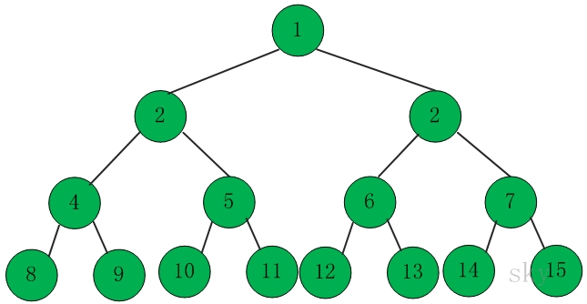

二叉树

[TOC]

# 1. 二叉树常用性质

1.  一颗满二叉树，第一层1($2^0$)个结点，第二层2($2^1$)个结点，第三层4($2^2$)个......，如果二叉树一共有h层，那么第h层有$2^{h-1}$个结点，**一共**有
   $$
   2^0+2^1+2^2+...+2^{h-1}=\frac{1-2^h}{1-2}=2^h-1
   $$
   个结点，一个具有n个结点的满二叉树的深度是$\log_2{(n+1)}$，完全二叉树只是最后一排的结点小于等于同等深度的满二叉树的，那么一个具有n个结点的完全二叉树的深度是$\lfloor\log_2{(n)}\rfloor+1$

2. 若二叉树按照从上到下从左到右从1开始依次编号，则若某节点编号为k，则其左右子树根节点编号分别为**2k**和**2k+1**；(使用数学归纳法证明)，同理一个编号为n的结点，其父结点的编号为$\lfloor\frac{n}{2}\rfloor$。任意一个结点的编号减去根节点的编号+1，表示从上到下，从左到右数到当前结点时的元素总个数。如果结点从1开始编号，那么结点的编号就是数到当前结点时(算上当前结点)的总个数，对于完全二叉树，如果知道结点总个数N，任意一个结点的编号k和起始结点的编号s，如果2*(k-s+1)>N，就可以知道他没有子结点，可以使用这个结论来判断一个结点是叶子结点还是分支结点。

3. 类比满二叉树，完全二叉树只是从满二叉树中按照结点编号从大到小的顺序依次取下几个叶子节点组成，满二叉树的结点总数是奇数(见上面的推导)，如果一个完全二叉树的结点个数是奇数，那么所有的分支节点既有左孩子，又有右孩子；否则，编号最大的分支节点(其编号是$\frac{N}{2}$，编号最大的分支结点必然是编号最大的结点的父节点，编号最大的结点的编号是N)只有左孩子。

